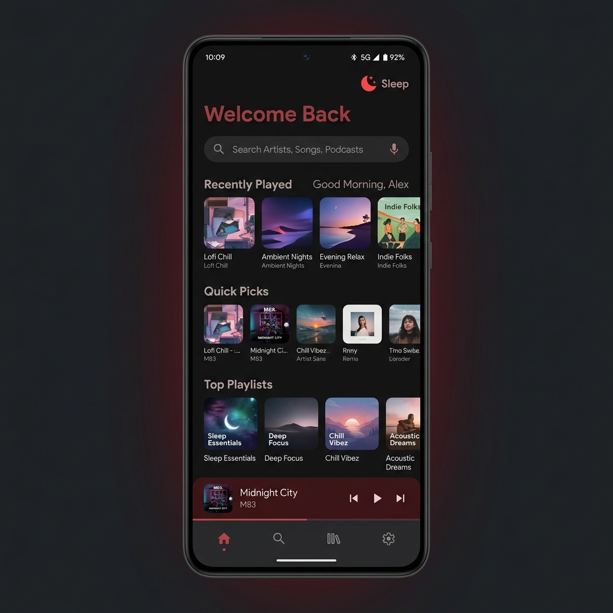
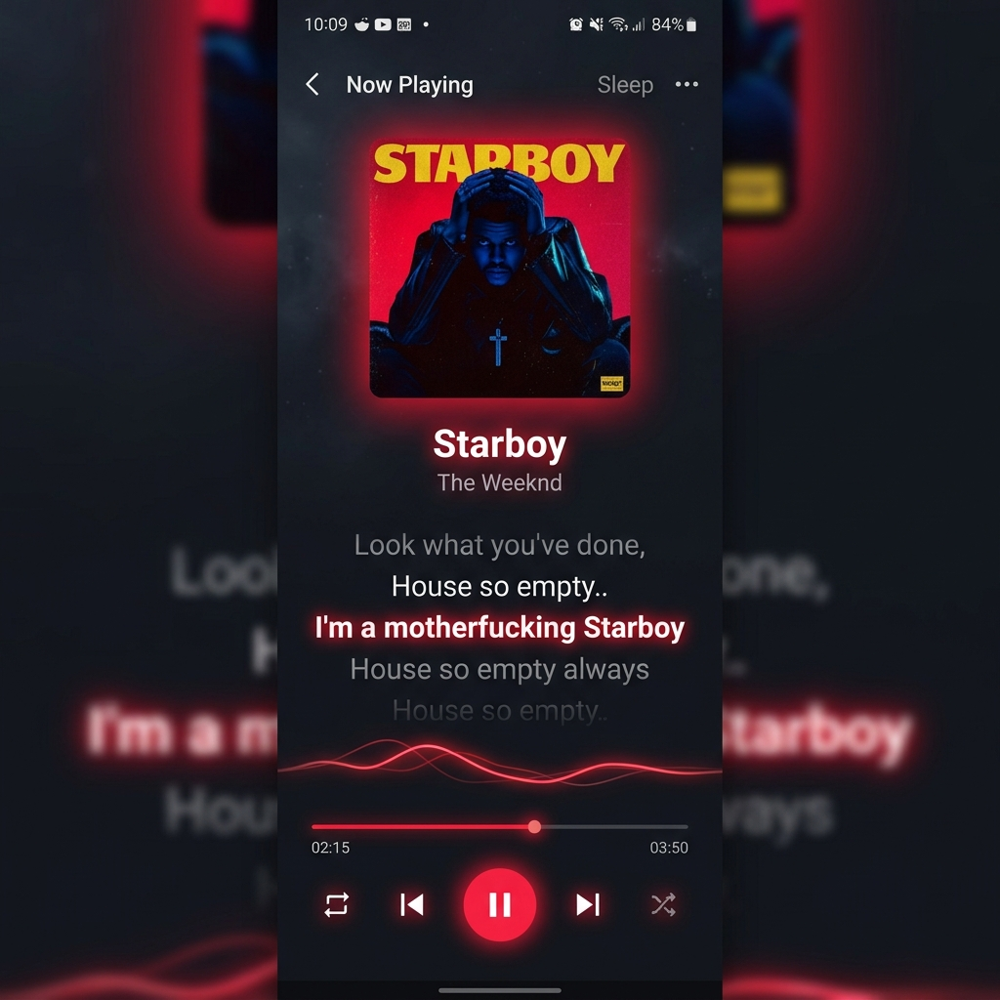
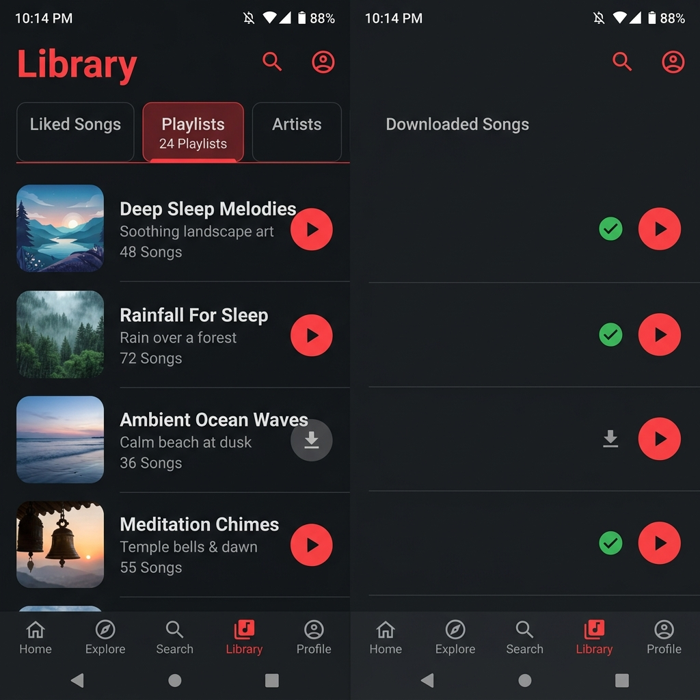

<h1>Sleep</h1>

A dark, premium Android music client fusing Spotify and YouTube Music into one seamless experience

## What is Sleep?

**Sleep** is a modern Android music client that brings together the best of Spotify and YouTube Music. It uses your Spotify account to power personalized recommendations, search, and home content — while streaming audio through YouTube Music.

The name "Sleep" reflects the core idea: bringing together two music platforms into a single, unified listening experience.

### Why Sleep?

- **Full Android 10, 11, 12, 13 & 14+ Compatibility** — Built and compiled with Java 17 bytecode standards and desugaring, running smoothly on Android 10 (Q), Android 11 (R), Android 12 (S), Android 13 (Tiramisu), and newer Android versions.
- **Round App Icon Design** — Stylish circular app badge with a red Spotify-inspired sound wave visual identity.
- **Spotify's personalization** — Your top tracks, favorite artists, and curated playlists from Spotify drive the recommendations.
- **YouTube Music's catalog** — Access YouTube Music's vast library for streaming, including rare tracks, live performances, and remixes.
- **No setup required** — Just log in with your Spotify account directly in the app. No developer dashboard, no Client ID, no extra steps.
- **No Spotify Premium required** — Sleep uses Spotify's data APIs (not streaming), so a free Spotify account is all you need.
- **Built-in recommendation engine** — A custom algorithm builds personalized queues using your Spotify listening history, without relying on deprecated API endpoints.

## App Screenshots & Visual Reference

  <table>
    <tr>
      <td align="center" width="33%">
        <b>Home Screen</b> 
        Personalized quick picks, Spotify integration & mood filters  
        
      </td>
      <td align="center" width="33%">
        <b>Music Play Section (Now Playing)</b> 
        Live playback controls, live lyrics & glowing audio visualizer  
        
      </td>
      <td align="center" width="33%">
        <b>Library & Playlists</b> 
        Liked songs, custom playlists & offline downloaded tracks  
        
      </td>
    </tr>
  </table>

## Features

### Spotify Integration
- **Spotify as search source** — Search results powered by Spotify, with automatic YouTube Music matching for playback
- **Spotify as home source** — Home screen populated with your Spotify top tracks, top artists, playlists, and new releases
- **Spotify-only mode** — Option to hide all YouTube-based content and show exclusively Spotify-powered sections on the home screen
- **Smart queue generation** — Custom recommendation engine that builds radio-like queues from your Spotify taste profile (top tracks/artists across 3 time ranges, genre similarity, popularity matching)
- **Spotify library sync** — Access your Spotify playlists and liked songs directly in the app
- **Spotify-to-YouTube matching** — Fuzzy matching algorithm with local caching for fast, accurate track resolution
- **Manual match override** — If a Spotify track is matched to the wrong YouTube video, you can manually fix it by pasting the correct YouTube link. The override is saved permanently and takes priority over automatic matching
- **Spotify album browsing** — Dedicated album screen for Spotify albums with full tracklist, metadata, and one-tap playback
- **Hybrid profile cache** — 3-tier data strategy (GraphQL → REST API → local DB) with persistent caching for instant home screen loading on app restart, automatic rate-limit handling, and parallel artist image enrichment
- **Artist navigation** — Tap any Spotify artist on the home screen to navigate directly to their YouTube Music artist page

### Lossless Audio (Experimental)
- **Qobuz backend** — Optional FLAC and Hi-Res (up to 24-bit / 192 kHz) streaming via the Qobuz catalog, replacing YouTube Music's lossy audio
- **Deterministic matching** — Uses ISRC (the universal track identifier shared by Spotify and Qobuz) so Spotify-sourced tracks resolve to their exact Qobuz counterpart without ambiguity
- **Persistent match cache** — Once a track has been resolved on Qobuz, the match is saved locally so subsequent plays skip the search step entirely
- **Multi-backend fallback** — Three independent Qobuz resolvers (Monokenny, Jumo, Squid) are tried in sequence if the primary one is rate-limited or unavailable
- **Quality tiers** — Choose between AAC 320 kbps, CD quality (16-bit / 44.1 kHz), or Hi-Res (up to 24-bit / 192 kHz) per your preference and connection
- **Automatic YouTube fallback** — If a track isn't on Qobuz, or all resolvers fail, playback falls back silently to the standard YouTube Music stream — no error, no skip
- **Hidden behind a toggle** — Disabled by default; opt-in from the Spotify integration settings

### Core Music Features
- Follow Developer section in Settings (Instagram @shoven_ghosh, X @shovonGhoseqsr, GitHub ghoshshovon80-lang)
- Full Android 10, 11, 12, 13, 14, 15 runtime compatibility
- Round App Icon in launcher and notification area
- Play any song or video from YouTube Music
- Background playback with MediaSession controls
- Personalized quick picks & recommendation algorithms
- Library management & local downloaded song playback
- Listen together with friends
- Live time-synced lyrics with word highlighting
- YouTube Music account login support
- Syncing of songs, artists, albums and playlists
- Skip silence & audio normalization
- Adjust tempo / pitch
- Home screen widget with playback controls
- Light / Dark / Black / Dynamic theme
- Sleep timer & Material 3 design

## Download

### 🚀 [Direct Download APK (Latest Release)](https://github.com/ghoshshovon80-lang/sleep/releases/latest/download/Sleep.apk)

[-2ea44f?style=for-the-badge&logo=android&logoColor=white)](https://github.com/ghoshshovon80-lang/sleep/releases/latest/download/Sleep.apk)

> 📥 **Direct Link**: Download the latest build directly via [Sleep.apk Direct Link](https://github.com/ghoshshovon80-lang/sleep/releases/latest/download/Sleep.apk) or visit the [Releases page](https://github.com/ghoshshovon80-lang/sleep/releases). Open the `.apk` file on your Android device to install (allow "Install from unknown sources" if prompted).

## Android Version & Device Compatibility

| Android Version | API Level | Status | Details |
|---|---|---|---|
| **Android 8.0 / 8.1 (Oreo)** | API 26 / 27 | ✅ Supported | Minimum supported SDK version |
| **Android 9 (Pie)** | API 28 | ✅ Supported | Fully supported |
| **Android 10 (Q)** | API 29 | ✅ Fixed & Supported | Storage permission handling & JVM 17 compatibility |
| **Android 11 (R)** | API 30 | ✅ Fixed & Supported | Scoped storage & background service compatibility |
| **Android 12 / 12L (S)** | API 31 / 32 | ✅ Fixed & Supported | Exported activity/service component specs & theme |
| **Android 13 (Tiramisu)** | API 33 | ✅ Fixed & Supported | Media notification & granular media permissions |
| **Android 14 / 15+** | API 34 / 35 | ✅ Supported | Modern target API standard |

## How the Spotify Integration Works

Sleep connects to your Spotify account through a built-in WebView login — no developer setup or Client ID required:

1. **Authentication** — You log in with your regular Spotify credentials (email, Google, Facebook, or Apple) directly inside the app. Sleep extracts session cookies and generates access tokens using TOTP.
2. **Data layer** — Sleep communicates with Spotify primarily through GraphQL endpoints with REST API fallbacks.
3. **Home screen** — When "Use Spotify for Home" is enabled, Sleep builds a personalized home feed from your top tracks, top artists, playlists, and new releases.
4. **Profile caching** — Your Spotify profile data is persisted locally and served instantly on app restart.
5. **Search** — Search queries go through Spotify's GraphQL search. Results are displayed as Spotify content; tapping a song resolves it to YouTube Music.
6. **Queue generation** — When you play a Spotify-sourced song, Sleep's custom recommendation engine builds a queue tailored to your listening habits.
7. **Playback** — Each Spotify track is matched to its YouTube Music equivalent using fuzzy matching with local DB persistence.

## How the Qobuz Lossless Integration Works

When the Qobuz toggle is enabled (**Settings → Integrations → Spotify → "Use Qobuz for lossless playback"**), Sleep routes audio through Qobuz's FLAC catalog instead of YouTube Music's lossy AAC streams.

1. **Match resolution** — Tracks are resolved via ISRC (the universal track identifier) for exact matching.
2. **Backend cycling** — Qobuz is accessed through three independent open community resolvers (Monokenny, Jumo, Squid).
3. **Persistent caching** — Successful Qobuz matches are saved in the local database.
4. **YouTube Fallback** — If Qobuz resolvers hit rate-limits or missing tracks, playback seamlessly falls back to YouTube Music.

## Setup & Installation

### Android Installation

1. Download **Sleep.apk** from the link above.
2. Open the file on your device. If prompted, grant permission to install from unknown sources.
3. Open **Sleep** and enjoy!

### Spotify Setup

1. In Sleep, go to **Settings → Integrations → Spotify**.
2. Tap **Login** and sign in with your Spotify account.
3. Turn on **"Use Spotify for Search"** and **"Use Spotify for Home"**.
4. Return to the home screen and pull down to refresh.

> **Tip for Smooth Playback**: Disable battery optimization for Sleep in your phone settings (**Settings → Apps → Sleep → Battery → Unrestricted**). This prevents Android from killing background playback services.

## Author & Maintainer

**Sleep** is developed and maintained by [Gourab Ghosh](https://github.com/ghoshshovon80-lang).

### Open Source Libraries & Technologies

- [**Kizzy**](https://github.com/dead8309/Kizzy) — Discord Rich Presence implementation
- [**Better Lyrics**](https://better-lyrics.boidu.dev) — Time-synced lyrics with word-by-word highlighting
- [**SimpMusic Lyrics**](https://github.com/maxrave-dev/SimpMusic) — Lyrics data through the SimpMusic Lyrics API
- [**MusicRecognizer**](https://github.com/aleksey-saenko/MusicRecognizer) — Music recognition and Shazam API integration

## License & Disclaimer

This project is licensed under the GPL-3.0 License. It is an independent open-source music player and is not affiliated with YouTube, Google LLC, or Spotify AB.
